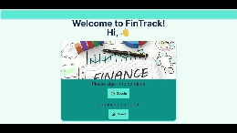
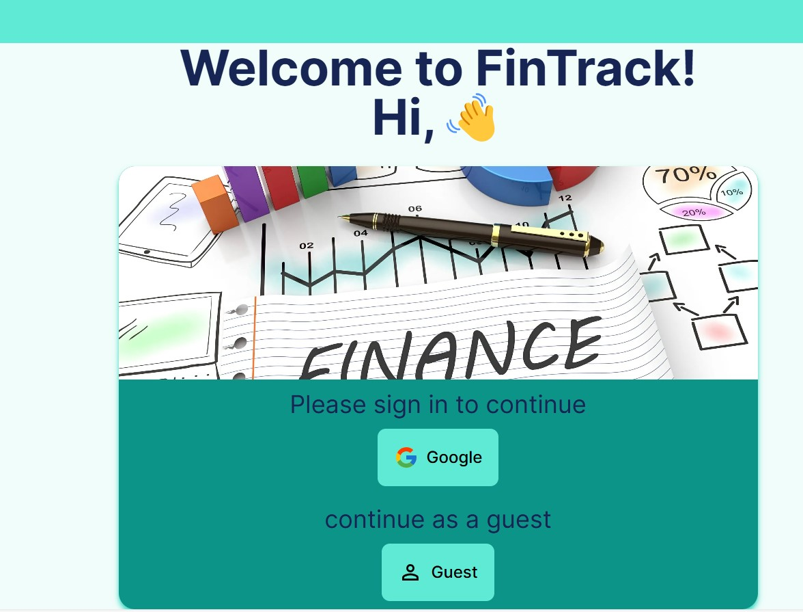
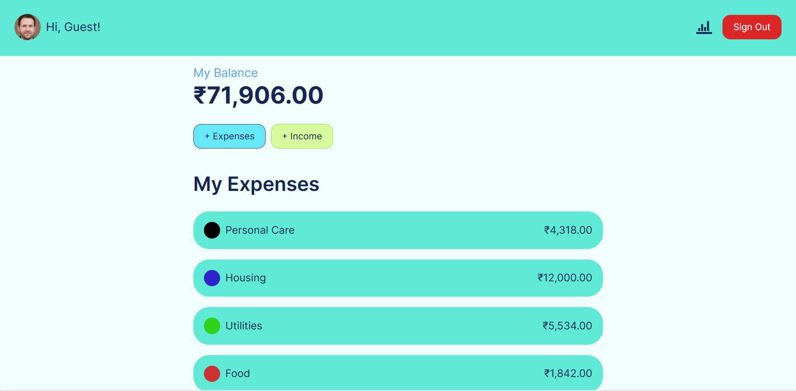
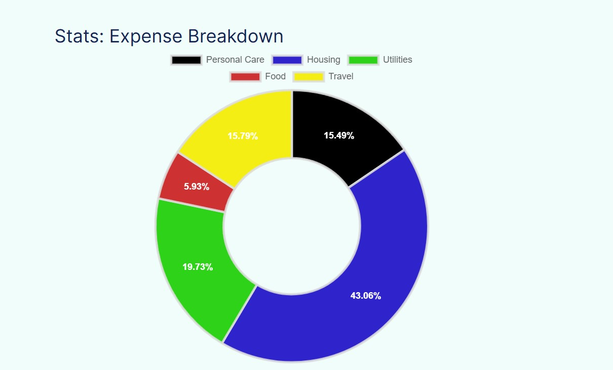
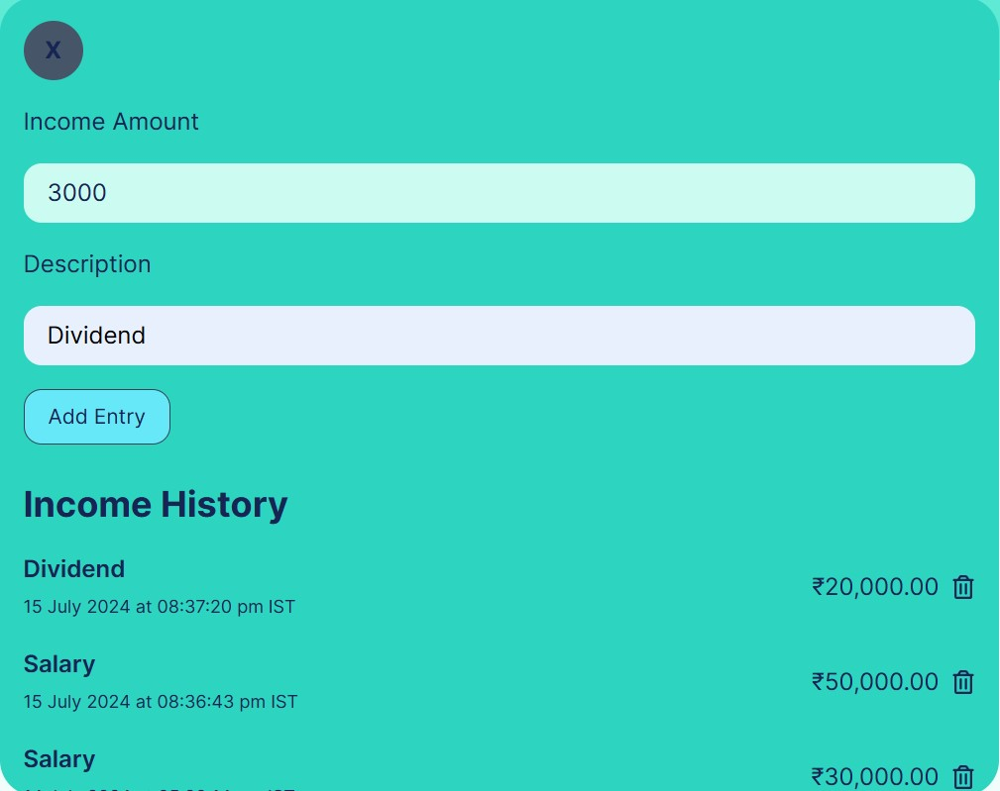
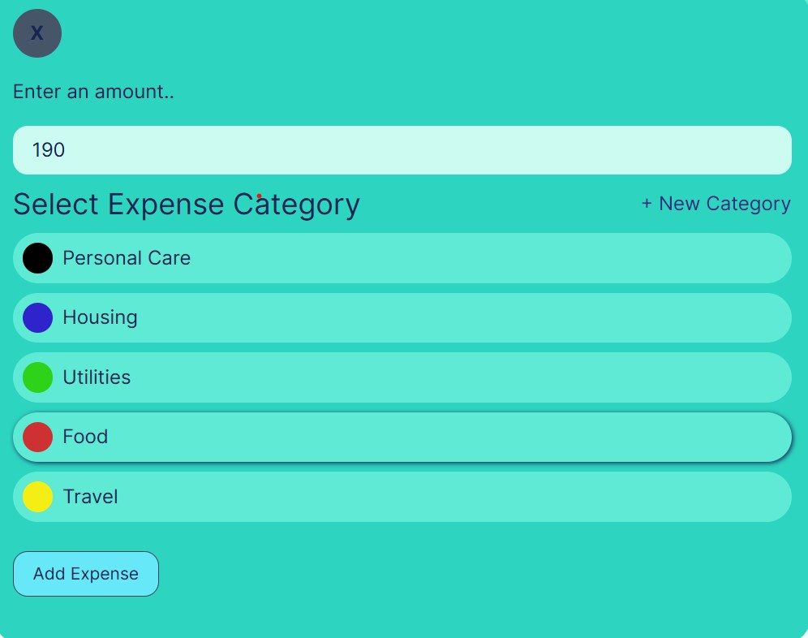
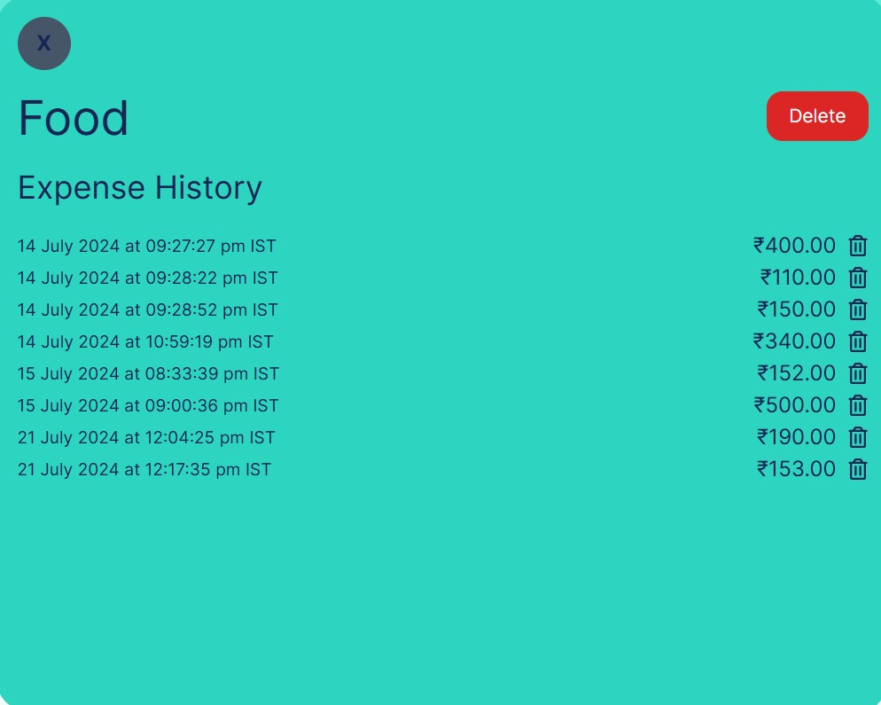

# FinTrack 💵📈📝

This repo contains the **source code** of an **Personal Finance Website** named [Fintrack](https://fintrack-eight.vercel.app/) which was created using **Next.Js** and **Firebase** for authentication and Data storage.

## Demo Video

## LoginPage

This App allow users to login either with their google account or as a guest.

## HomePage

This homepage shows various important metrics like:

-   **Total Balance:** which is the total amount after substracting total expenses from the total income.
-   **Expenses List:** The expenses are divided in categories and are displayed with total expenses and the color to indicate the categories.
-   **Doughnut Chart:** This shows the breakdown of expenses in each category using doughnut chart as shown below.

## Doughnut Chart

## Add Income Modal

This modal shows the Income History with its description, amount,date and time at which income was recorded. It also allow user to add and delete Income from the Income History.

## Add Expense Modal

This modal allows user to add an expense with an amount with a category from the provided options.

## View Expense History

This modal allow user to view the expense history based on category, allows the deletion of a category and also deletion of individual expense from the expense History list.

## Features

This FinTrack App provides various features such as:

1. Adding Expenses
2. Adding Income
3. Adding Category
4. Deletion of Expenses
5. Deletion of Income
6. Deletion of Category
7. History view of Income
8. History view of Expenses
9. Doughnut chart of Expense Breakdown
10. Authentication using Firebase

## How to use this Repo

-   Add `.env.local` file with variable defined in `.env.example` with appropriate values.
-   Install Dependencies using `npm install`
-   Run the server in Development mode using `npm run dev`
-   To build this project use `npm run build`

Click this link to see the live demo of this repo: [Fintrack](https://fintrack-eight.vercel.app/)
